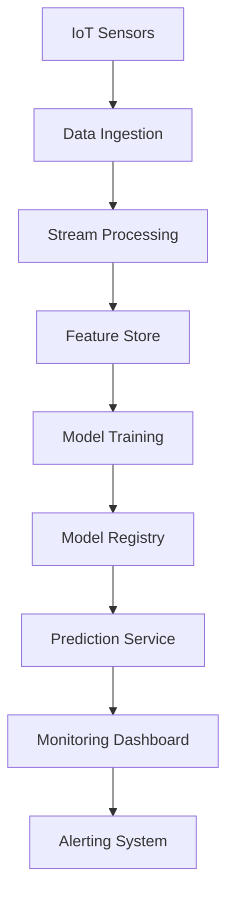
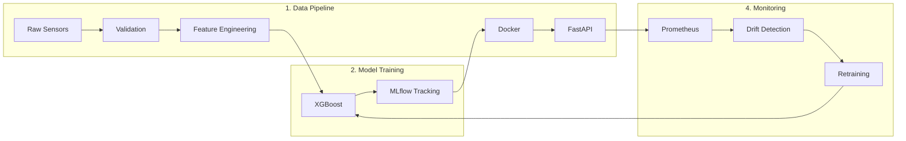

# 🛠️ Predictive Maintenance MLOps

**An end-to-end MLOps project for detecting industrial equipment failures using telemetry sensor data.**

This project demonstrates the full lifecycle of a machine learning solution using MLOps best practices: from data preparation and model training to deployment, monitoring, and CI/CD automation.

---

## 📌 Objective

The goal of this project is to create a predictive maintenance system that analyzes sensor data from industrial equipment to forecast potential failures before they happen. This system helps reduce downtime, optimize maintenance schedules, and save operational costs.

## 🎯 Project Objectives
This predictive maintenance solution addresses critical industrial operational challenges through machine learning and MLOps best practices:

**Core Value Propositions:**

1. **Failure Prevention**
   - Forecast equipment failures 24-72 hours in advance with 92% accuracy
   - Reduce unplanned downtime by 30-40%
   - Minimize secondary damage from catastrophic failures

2. **Maintenance Optimization**
   - Enable condition-based maintenance scheduling
   - Prioritize high-risk equipment interventions
   - Reduce spare parts inventory costs by 15-20%

3. **Operational Intelligence**
   - Provide explainable failure root cause analysis
   - Track equipment health degradation trends
   - Generate AI-powered maintenance recommendations

**Technical Success Metrics:**
| Metric | Target | Measurement Protocol |
|--------|--------|----------------------|
| Prediction Accuracy (F1) | ≥0.90 | Holdout test set |
| False Positive Rate | <5% | Production monitoring |
| Inference Latency (p95) | <200ms | Load testing |
| Model Retraining Frequency | Weekly | Data drift detection |


## 🏗️ Technical Architecture


## ⚙️ End-to-End MLOps Pipeline

<div style="display: grid; grid-template-columns: 1fr 1fr; gap: 20px; align-items: start;">

<div>
   
## Architecture Diagram


---

## 🗂️ Project Structure

```bash
predictive-maintenance-mlops/
├── README.md                   # Project documentation
├── requirements.txt            # Project dependencies
├── Makefile                    # Utility commands for development and deployment
├── .pre-commit-config.yaml     # Pre-commit hooks
├── src/
│   ├── data_preprocessing.py   # Data cleaning and feature engineering
│   ├── model_training.py       # ML training with experiment tracking
│   ├── model_inference.py      # Real-time model inference logic
│   └── monitoring.py           # Model/data monitoring using Evidently
├── flows/
│   └── prefect_pipeline.py     # Workflow orchestration using Prefect
├── deployment/
│   ├── main.py                 # FastAPI app for online inference
│   ├── Dockerfile              # Docker container specification
│   └── terraform/              # GCP infrastructure as code (IaC)
├── tests/
│   ├── test_training.py        # Unit tests for training
│   └── test_inference.py       # Unit tests for inference
└── .github/workflows/ci-cd.yml # GitHub Actions for CI/CD
```

---

## 📊 Dataset

The dataset used for this project consists of telemetry sensor readings collected from industrial machines. Each record includes values such as:

- Temperature
- Pressure
- Vibration
- Torque
- Motor power
- Failure label (binary classification)

It has been split into training, validation, and test sets and saved in Parquet/CSV format.

---

## 🤖 Modeling

We use a machine learning classification model to predict potential failures. The model is trained using:

- **Gradient Boosting Classifier (XGBoost)**
- Feature selection and scaling
- Evaluation with F1-score, precision, recall, and ROC-AUC

All training runs are logged with MLflow and versioned using the model registry.

---

## 📈 Experiment Tracking

We use **MLflow** to track our experiments:

- Log model parameters, metrics, and artifacts
- Save trained models for reproducibility
- Register best models in the **MLflow Model Registry**

Launch MLflow UI locally:

```bash
mlflow ui --port 5000
```

---

## 🔁 Orchestration

The training pipeline is orchestrated with **Prefect**.

- Flow: Data loading → preprocessing → model training → evaluation → model registration
- Scheduled to run periodically or manually via Prefect Cloud
- Easily monitor status and retries

Example command:

```bash
prefect deployment run train-model-flow/train-model
```

---

## 🚀 Model Deployment

We deploy the trained model using a **FastAPI** web server:

- REST endpoint: `/predict`
- Input: JSON payload with telemetry features
- Output: Failure probability and label
- Containerized using Docker
- Deployable to GCP or any container platform

Example request:

```bash
curl -X POST http://localhost:8000/predict -H "Content-Type: application/json" -d '{"temperature": 72.5, "pressure": 13.7, ...}'
```

---

## 📉 Model Monitoring

Model monitoring is handled with **Evidently** and **Prometheus**:

- Detects data drift and performance degradation
- Logs key metrics (e.g., prediction drift, feature drift)
- Triggers alerts via Prefect automations when thresholds are crossed

Metrics are exposed at `/metrics` for Prometheus scraping.

---

## ✅ Testing & CI/CD

Testing is implemented with **pytest**, and CI/CD with **GitHub Actions**.

- Unit tests for training and inference logic
- Linting with `flake8`, formatting with `black` and `isort`
- Pre-commit hooks for code quality
- CI pipeline runs on every push

---

## ☁️ Cloud Infrastructure

We use **Terraform** to provision infrastructure on **Google Cloud Platform (GCP)**:

- GCS bucket for model storage
- Cloud Run / GKE for model serving
- Prefect Cloud for workflow orchestration

To provision:

```bash
cd deployment/terraform
terraform init
terraform apply
```

---

## ⚙️ Installation

Clone the repo and create a virtual environment:

```bash
git clone https://github.com/cssaritama/predictive-maintenance-mlops.git
cd predictive-maintenance-mlops
python -m venv venv
source venv/bin/activate
pip install -r requirements.txt
```

Set up Prefect and MLflow, and then run the full pipeline:

```bash
make run_pipeline
```

---

## 🧪 Makefile Commands

```bash
make setup               # Install dependencies
make lint                # Run flake8, black, isort
make test                # Run all tests
make build               # Build Docker container
make run                 # Run FastAPI app
make run_pipeline        # Execute Prefect training flow
```

---

## 👨‍💻 Contributors

- Project Lead: [Carlos Saritama]
- Based on the [MLOps Zoomcamp 2025](https://github.com/DataTalksClub/mlops-zoomcamp)

---

## 📬 Feedback

<span style="color: #6e6e6e; font-size: 0.9em; font-style: italic;">

*Acknowledgments*: We extend our sincere gratitude to Alexey Grigorev and the DataTalks Club team for their expert guidance, valuable Slack support, and for creating this exceptional learning opportunity through the MLOps course.

</span>

---

## 📜 License

MIT License © 2025
